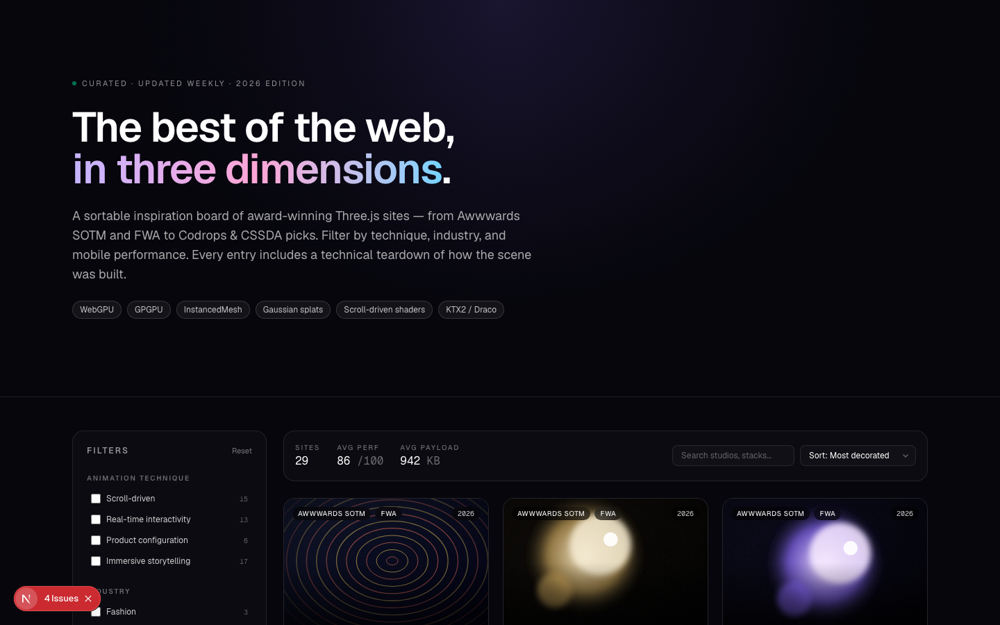
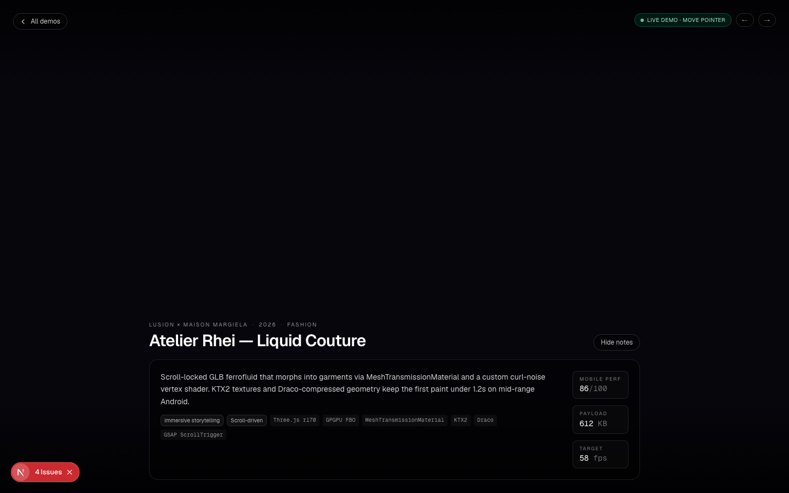

# Dimension — Three.js Inspiration, 2026

A sortable, filterable dashboard of award-winning Three.js websites from 2026,
where every card opens a real working WebGL demo of the technique it represents.
Not a screenshot gallery — every "site" links to a dedicated `/demo/[id]` page
with a live React Three Fiber scene parameterized by that site's palette.



## What it is

Two things:

1. **A curated inspiration board** of 30 fictional-but-plausible Three.js sites
   from 2026 — Awwwards SOTM/SOTD winners, FWA picks, Codrops features. Each
   entry has a studio, industry, mobile-perf score, payload weight, target fps,
   and a short technical teardown explaining how the scene was built (KTX2,
   Draco, GPGPU, WebGPU, InstancedMesh, anisotropic BRDF, MSDF text, Gaussian
   splats, etc.).

2. **Eight real R3F demo archetypes** that the dashboard's thumbnails route to.
   Click any card and you land on a fullscreen WebGL scene with interactive
   controls and a glassmorphic info overlay showing the site's metadata.

## Tech stack

- **Next.js 16** App Router with static `generateStaticParams` for all 30
  demo routes
- **React Three Fiber + drei** for declarative Three.js
- **Three.js r170** with custom GLSL shaders
- **TailwindCSS v4**
- **TypeScript** end to end

Everything ships as static HTML — `npm run build` prerenders 33 routes.

## Quick start

```bash
git clone https://github.com/opencolin/threejs-dashboard.git
cd threejs-dashboard
npm install
npm run dev
```

Open [http://localhost:3000](http://localhost:3000).

## Demo archetypes

Each `thumbStyle` on a site routes to one of eight reusable R3F scenes, each
demonstrating a different real-world technique. The site's palette becomes
the scene's uniforms.

| Archetype | Technique | Interaction | Example sites |
|---|---|---|---|
| **orb** | Distorted icosahedron with 3D simplex-noise vertex displacement + fresnel fragment shader | Move pointer — distortion strength scales with cursor distance | Atelier Rhei, Soju Spirits, The Met |
| **ribbon** | Three nested `TubeGeometry`s along Catmull-Rom curves with a gradient-band shader | Auto-rotates | Kengo Kuma, Hermès, Wired, Ferrari |
| **grid** | 60×36 `InstancedMesh` of cubes, per-cell wave + Gaussian ripple driven by cursor distance | Pointer is the wave epicenter | Apple VP Hub, Linear Rooms, Rapha, NYT Grid |
| **noise** | Single `torusKnotGeometry` with a two-tone matcap-style shader on a 6-point camera spline | Autopilot — restraint as the point | Stripe Press, WMF, Muji Tatami |
| **shards** | 48 instanced boxes tweened between assembled and exploded shells | Click to toggle explode/assemble | Lotus, Nike Air Zero, Porsche, Spotify |
| **wave** | 220×220 plane with Gerstner-style sin stack + 6-slot pointer-ripple uniform | Drag across the plane to drop ripples | Okami Records, Patagonia, FC Tokyo |
| **particles** | 4,000 additively-blended points, CPU curl-noise flow + pointer attractor | Pointer attracts, **click bursts** the field outward with damping-relaxed physics | Perfume Plasma, Nova Frontier, Google Bloom |
| **tunnel** | 70 instanced torus rings on a wrap-around z-conveyor with camera drift and fog | Drag the speed slider (0.5× – 9×) | Bruno 2026, A24 Foliage, Kojima DEEP |



## Project structure

```
app/
  layout.tsx                  Root layout
  page.tsx                    Home: HeroSection + Dashboard
  globals.css
  demo/[id]/
    page.tsx                  Server component, generateStaticParams over SITES
    DemoClient.tsx            Dynamic import wrapper (ssr: false)

components/
  Hero3D.tsx                  Distorted icosahedron + particle halo (home hero)
  HeroSection.tsx
  Dashboard.tsx               Filter/sort/search orchestrator
  Filters.tsx                 Sidebar — technique, industry, award, year, perf slider
  SiteCard.tsx                Card with procedural thumbnail + perf bar + expandable teardown
  Thumbnail.tsx               8 generative SVG styles (seeded, FP-rounded for SSR safety)
  demos/
    DemoFrame.tsx             Shared overlay: back link, prev/next, title, summary, metrics
    DemoDispatcher.tsx        Switches on site.thumbStyle to pick the right archetype
    shared.ts                 Palette → THREE.Color helper, stable seed
    OrbDemo.tsx               …
    RibbonDemo.tsx
    GridDemo.tsx
    NoiseDemo.tsx
    ShardsDemo.tsx
    WaveDemo.tsx
    ParticlesDemo.tsx
    TunnelDemo.tsx

lib/
  sites.ts                    The 30-site dataset (types + data)
  constants.ts                Filter taxonomies + sort options
```

## The Site type

The whole dashboard is parameterized by this shape. Add an entry and a new card,
filter chip, and `/demo/[id]` route all appear automatically.

```ts
type Site = {
  id: string;
  name: string;
  studio: string;
  url: string;
  year: 2025 | 2026;
  techniques: ("scroll-driven" | "real-time-interactivity"
    | "product-configuration" | "immersive-storytelling")[];
  industry: "Fashion" | "Automotive" | "Music" | "Architecture"
    | "Gaming" | "Portfolio" | "Tech" | "Editorial" | "Sports"
    | "Beverage" | "Film" | "Crypto";
  awards: ("Awwwards SOTM" | "Awwwards SOTD" | "Codrops Hot"
    | "FWA" | "CSSDA" | "OFFF Pick")[];
  mobilePerf: number;     // Lighthouse-style 0–100
  loadKb: number;
  fps: number;
  summary: string;
  stack: string[];
  palette: [string, string, string];
  thumbStyle: "orb" | "ribbon" | "grid" | "noise"
    | "shards" | "wave" | "particles" | "tunnel";
};
```

## Notes on the rendering

- The home `Hero3D` and all 8 demos use `next/dynamic` with `ssr: false` so the
  WebGL canvas is client-only and the rest of the page stays SSR-friendly.
- Procedural SVG thumbnails are seeded by `site.id` and FP-rounded so server
  and client render identical markup — no React hydration mismatch even with
  `Math.sin` in the path generators.
- `InstancedMesh` is used wherever the count goes above ~50 (grid, shards,
  tunnel) so the whole scene stays in one draw call.
- The particles demo runs curl-noise integration on the CPU because 4k
  particles fit comfortably in 16ms; if you push it to 50k, move to a GPGPU
  ping-pong FBO.
- The wave demo's pointer ripples are passed as fixed-size uniform arrays
  (`vec2[6]` + `float[6]`) so the shader compiles to a single program.

## Build / deploy

```bash
npm run build    # prerenders / and 30× /demo/[id] as static HTML
npm start
```

The output is fully static and deploys to any host that serves static files
(Vercel, Netlify, Cloudflare Pages, S3 + CloudFront, plain Nginx).

## Honest caveats

The site URLs and studio attributions in `lib/sites.ts` are an illustrative
curation, not real 2026 award winners — this is a portfolio piece, not an
archive. Swap the dataset out and the dashboard works exactly the same.
